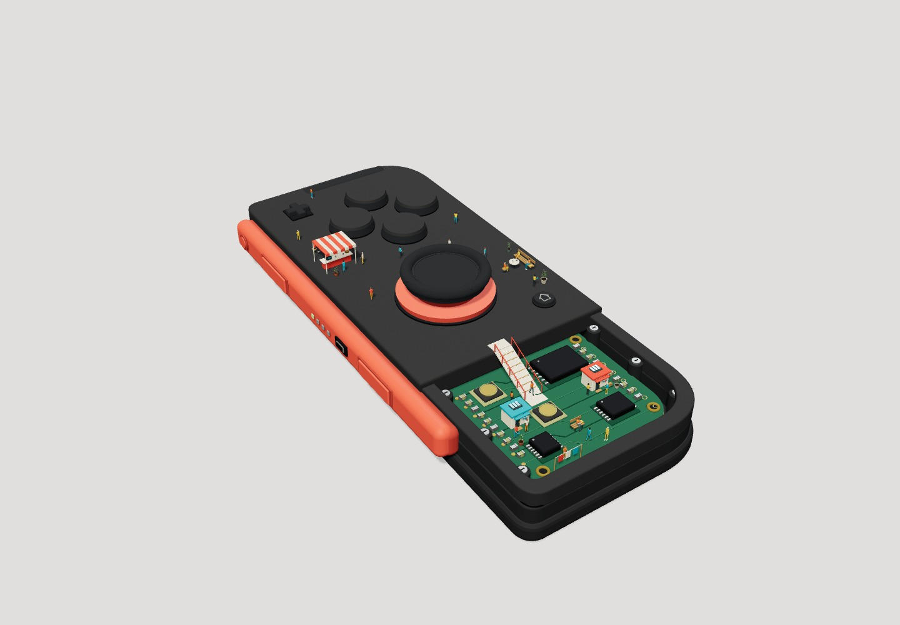
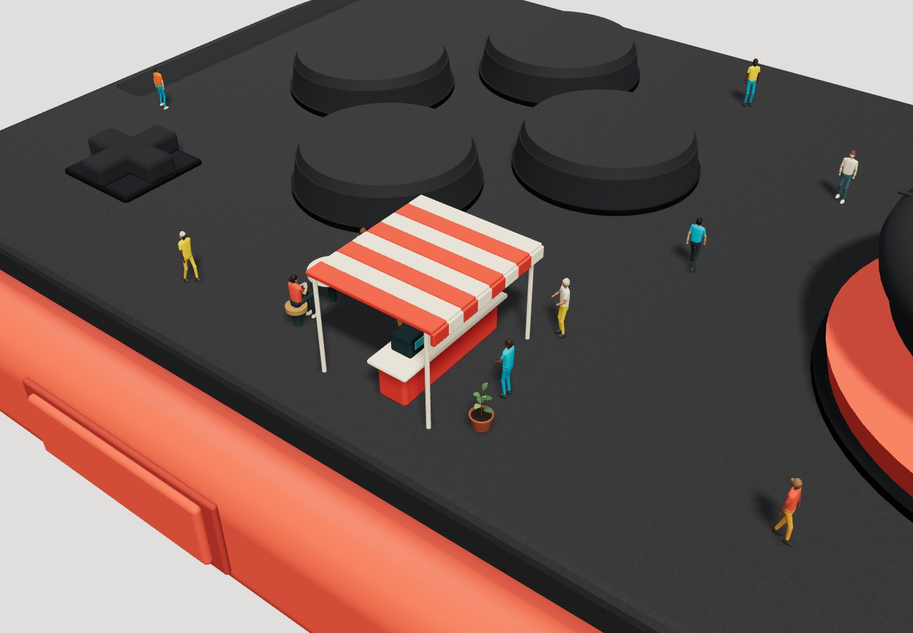
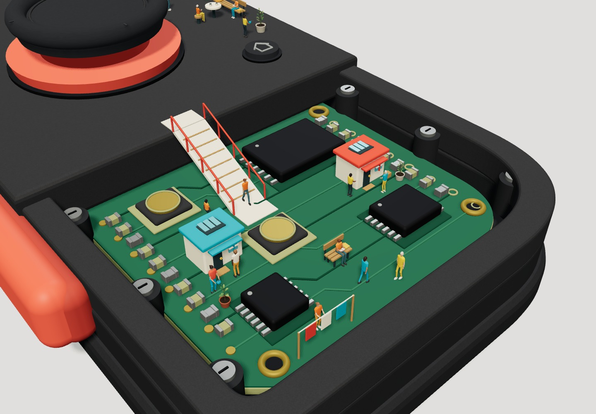

# Tiny people

A living browser miniature inspired by the supplied Joy-Con reference: 26 tiny residents share a button-side café, joystick courtyard and two homes among the circuitry of a charcoal-and-coral controller. The full-viewport scene shows only the model. Its four physical face buttons retain X/Y/A/B markings; interface text and other scene labels remain absent.

Residents use adult proportions, tapered limbs, rounded shoes and separate fabric, skin and hair surfaces. Three plant forms combine thin curved leaves and branching stems with open pot rims and recessed granular soil. Their shapes and materials are generated locally from source.

The integrated phase-10 candidate adds deterministic resident choices, reciprocal greetings, one shared café cup, cooperative gardening and individual reactions to real controller openings. Its source and remaining original-checkout verification are tracked in the [current work plan](docs/work/1_controller-life-expansion/plan.md). The behavior and commands below describe that candidate; final acceptance remains separate.

Desktop browsers are the supported target. The canvas follows desktop window resizing; dedicated mobile support and mobile validation are outside the current scope.

## Showcase



*A whole neighborhood on one controller.*



*Coffee beneath the buttons.*



*Homes, gardens and daily life among the circuitry.*

## Run locally

Use Node **24.12.0** (`.nvmrc`), then run:

```sh
npm ci
npm run dev
```

Open the local address printed by Vite. Controls work immediately:

- Hold **W / A / S / D** to pan forward, left, back or right across the controller plane, relative to the current view. Diagonals keep the same speed.
- Drag with a mouse to orbit; scroll to zoom.
- **Arrow keys** orbit, **+ / −** zoom, **R** restores the centered overview, and **Space** pauses or resumes resident life.
- Click the coral side rail, rear shoulder housing or joystick cap to open or close it. A local highlight and pointer cursor identify the part under the mouse. Dragging continues to orbit the camera.
- **Tab** focuses each movable part with a physical highlight; **Enter / Space** opens or closes the focused part. Space pauses life when a part is not focused.

Camera controls and deliberate opening remain available while life is paused. A reduced-motion preference starts life paused, makes opening immediate and responds to live preference changes; **Space** deliberately resumes life. **R** resets only the camera. Opening leaves the inhabited decks, ramp and furniture fixed. Residents can react to a real opening while life runs; an opening made while paused remains queued until life advances. Camera keys ignore editable fields and modifier shortcuts, and held movement stops when the page loses focus or visibility. Nonvisual control instructions remain available to screen readers. Stop the server with Ctrl+C when finished.

```sh
npm run typecheck
npm run build
npm run audit
npm run check:routes
npm run check:plants
npm run check:residents
npm run check:social-state
npm run check:social-time
npm run check:social-events
npm run check:social-approaches
npm run check:social-contact
npm run check:buttons
npm run check:mechanism-state
node scripts/mechanism-performance.mjs --check
npm run check:mechanisms
npm run preview
```

For headless browser verification, install Chromium with `npx playwright install chromium`, then run `npm run build` and `npm run check:browser`. To use an installed Chrome instead, set `PLAYWRIGHT_CHANNEL=chrome` in your shell. An optional `PLAYWRIGHT_CHROMIUM_EXECUTABLE` selects an existing Chromium binary. The check uses real drag, wheel and keyboard reset, captures camera and activity close-ups, checks console/network errors and desktop resizing, and closes its own browser and local server in `finally`. It also checks actual rendered panning in the production build. Captures and their SHA-256 manifest go to ignored `output/playwright/`; inspect them to verify text removal, geometry and framing, which interaction assertions alone cannot establish.

Run Vite-based verification commands sequentially within a checkout. Concurrent loaders can race while replacing their shared dependency cache. Preserve existing evidence before a gate replaces a report at its default output path.

Run `npm run check:exploration` for held-key WASD translation, keyboard pause, model-only desktop rendering, reduced motion on load and live changes, history return, persisted-page suspension, and unavailable/lost graphics recovery. It saves review captures in ignored `output/exploration/` and closes its owned resources. The former visible-button and preset checks were replaced to match the model-only requirement; dedicated mobile/touch branches were removed when the user limited support to desktop. Actual history navigation and synthetic persisted events are reported separately; a working history return alone does not establish a browser-cache hit.

The mechanism state gate checks reversible acceleration, endpoint events, blocked motion, reduced motion and validated restoration. The geometry gate certifies each continuous motion against the actual controller internals, route footprints, resident bodies, furnishings and plants; it also checks mechanism pairings and deliberately obstructed paths. Runtime checks revalidate live occupancy before movement. An obstruction holds the mechanism in place without relocating residents or props. Merged solid interiors use the union of their authored volumes, including overlaps.

After building, run `npm run check:mechanism-input` for actual surface picking and occlusion, the five-pixel click/drag boundary, keyboard access, lifecycle recovery, production input, 100 real rail resource cycles and CPU-work samples over 150 baseline and 600 active completed frames. At least twelve real commands must be distributed inside the active window, with at least 120 moving frames. Use installed Chrome (`PLAYWRIGHT_CHANNEL=chrome`, executable override unset). Its native closed, intermediate, open, focus and restored captures require visual review: a clearance pass alone does not establish a useful interior reveal.

The performance gate measures synchronous CPU updates and render submission, with baseline/active mean limits of 8/9 ms, p95 12 ms, maximum 40 ms and at most 5% strictly above 20 ms. It also limits drawing to 525 calls and 1.11 million triangles. Native frame intervals and the paired CPU mean difference are diagnostics; the measurement does not establish GPU completion. Browser checks adapt their observations and command pacing to low, high and changing frame cadence. Mandatory CPU mutation proofs cover cases that native cadence cannot distinguish. A stalled callback produces incomplete verification, and a test collects its required observations before asserting behavior.

Camera checks use frozen world time and independently observed camera transforms. A disabled-input check proves moving people cannot masquerade as working controls. Separate ordinary-time checks confirm walking, and the harness reports a bounded 150-frame local timing sample. Development-only scene inspection hooks are omitted from the production build.

The route gate samples all seven routes against the actual static geometry at intervals no greater than .025 units, checks .085-radius footprints and 17 stationary body placements, and samples actor pairs over 240 seconds. It deliberately tests an off-device path, a path through the joystick, and a book moved into a seated pelvis. The resident gate checks every transformed shoe vertex on slopes, seated thigh/shin clearance, actual head proportions, hand-to-prop surfaces, cup lifting/closure and rendered watering drops against the authored soil. Low-knee and detached-book mutations must fail. The plant gate checks closed leaf/pot geometry, bounded footprints, compatible material batching, and root contact with soil, including a deliberately lifted root. These bounded checks complement visual review of motion and furniture contact.

The production build goes to ignored `dist/`. The application uses Vite, TypeScript and Three.js; all geometry and materials are defined in source. No image, external font, model download, or runtime network service is required. The local npm cache lives in ignored `.npm/`.

In the phase-10 candidate, a pure 30 Hz model owns choices, interactions, shared reservations and prop ownership; presentation only translates copied frames into resident and prop geometry. Five supported local approaches supplement the seven existing routes. Circuit pairs keep their supported stationary positions. Gardening guidance precedes preparation, watering, drain, lowering and acknowledgment. Opening reactions can wait until an interaction ends; openings made while life is paused remain queued until life advances.

Social history is a versioned life time and complete ordered opening journal, replayed into the deterministic model. It is stored beside the existing mechanism history while preserving unrelated history fields. Camera reset preserves world state, and graphics or persisted-page recovery retains the in-memory model. Actual history navigation and synthetic persisted events remain separate checks. The state/contact checks cover 240 simulated seconds; their detailed geometry sampling and native reviews have their own bounds and do not establish unlimited-duration behavior or all-frame mesh clearance.

## Source layout

- `src/scene/controller.ts`: device shell, face controls, coral rail and exposed PCB.
- `src/scene/button-markings.ts`: source-drawn physical X/Y/A/B marks.
- `src/scene/mechanism-state.ts`: authoritative progress, velocity, targets, phases and bounded events.
- `src/scene/mechanism-clearance.ts`: continuous swept-geometry and live-occupancy checks.
- `src/scene/mechanism-geometry.ts`: mechanism geometry batching with authored solid boundaries.
- `src/mechanism-input.ts`: visible-surface picking, click/drag arbitration and nonvisual keyboard controls.
- `src/scene/geometry.ts`: reusable geometry helpers.
- `src/scene/community.ts`: café, courtyard, homes, ramp, routes and actual-geometry clearance checks.
- `src/scene/social-state.ts`: deterministic 30 Hz choices, interaction stages, reservations, prop ownership and replayable opening history.
- `src/scene/social-types.ts`: authority, frame, layout and history contracts.
- `src/scene/social-events.ts`: direct real-opening delivery, independent of the bounded diagnostic event ring.
- `src/scene/social-poses.ts`: copied social frames translated into contact-aware resident and prop poses.
- `src/scene/residents.ts`: material-specific instanced batches with walking and local activity poses.
- `src/scene/plants.ts`: broadleaf, herb and fern geometry, shared plant materials, pots and soil.
- `src/scene/physical-audit.ts`: triangle and solid-volume checks that preserve hollow spaces.
- `src/scene/environment.ts`: lighting, neutral surroundings and contact shadows.
- `src/scene/materials.ts`: deterministic procedural plastic grain.
- `src/main.ts`: camera, rendering lifecycle and accessible exploration controls.
- `src/style.css`: responsive scene presentation.

Device coordinates use Y up, negative Z toward the shoulder, and negative X toward the coral rail. The surface is at Y=1.55 and the circuit board at approximately Y=0.97. The right-controller face layout is X north, A east, B south and Y west.

The three reviewed README screenshots in `docs/showcase/` are versioned documentation assets. Reference images, other screenshots, dependencies, builds, browser artifacts and scratch work are ignored. Keep reusable source, configuration, lockfiles and concise documentation in Git. The original reference and `LICENSE` must be preserved. No affiliation with Nintendo is implied.
