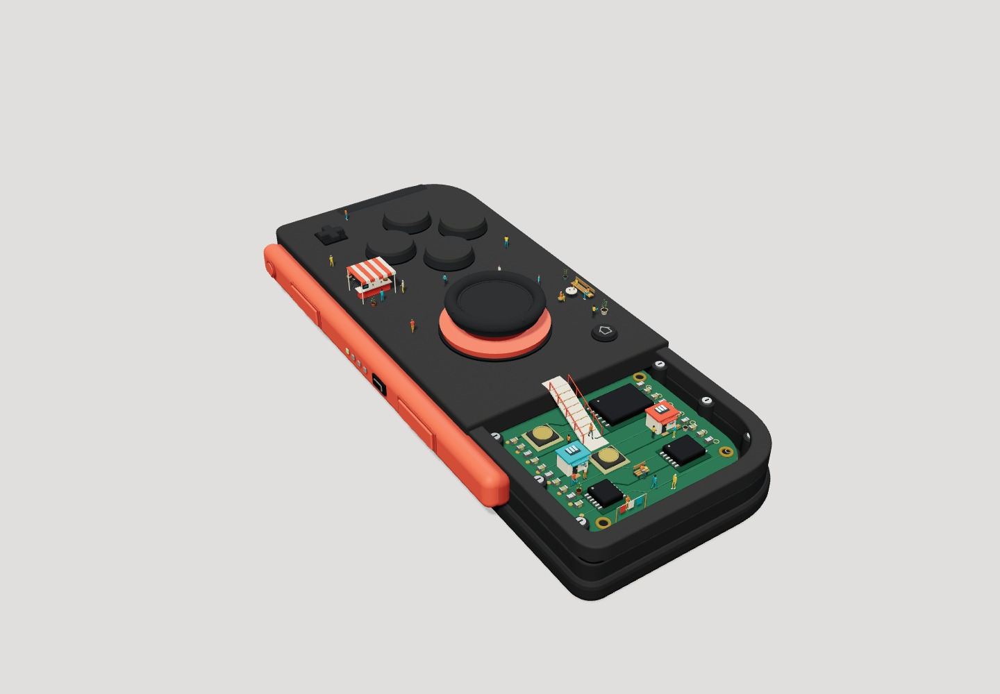
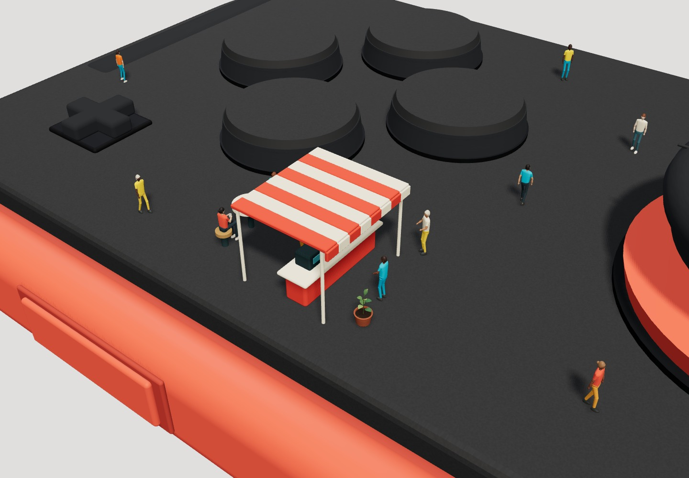
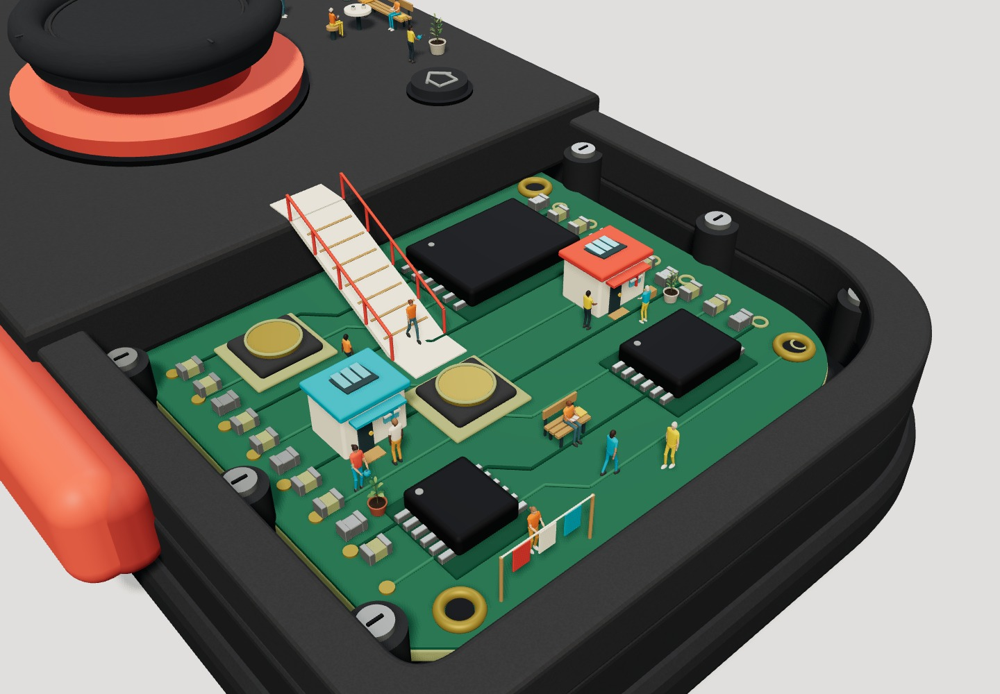

# Tiny people

**[Explore the miniature →](https://yanfengliu.github.io/tiny_people/)**

A little neighborhood inside a charcoal-and-coral controller. Twenty-six residents meet for coffee, greet their neighbors and tend the gardens between its buttons and circuitry. Wander through the café, courtyard and two tiny homes at your own pace—there is nothing to win or manage.

Open it in your browser, then orbit, zoom and look closer. You can even open three parts of the controller to peek inside.



*A whole neighborhood on one controller.*

## Explore

| Action | Control |
| --- | --- |
| Look around | Drag with the mouse or one finger, or use the arrow keys |
| Move across the scene | Hold **W / A / S / D** |
| Zoom | Pinch or spread two fingers, scroll, or press **+ / −** |
| Return to the overview | **R** |
| Pause or resume the residents | **Space**, when no movable part is focused |
| Peek inside | Click the coral side rail, rear shoulder housing or joystick cap |
| Press a button | Hold any face button, **+** or home button |
| Move the joystick | Drag its cap; release to center it |
| Open a part with the keyboard | **Tab** to highlight a part, then **Enter** or **Space** |

With a button focused, hold **Enter** or **Space** to press it. With the joystick focused, hold the **arrow keys** to tilt it.

You can still explore while the residents are paused. If your device requests reduced motion, life starts paused and the movable parts open instantly.

## Around the neighborhood



*Coffee beneath the buttons.*



*Homes, gardens and daily life among the circuitry.*

## Run locally

With Node **24.12.0** installed:

```sh
npm ci
npm run dev
```

Open the address printed in the terminal. Press **Ctrl+C** in that terminal when you are done.

Made with TypeScript and Three.js. The scene is built entirely from code.

[MIT licensed](LICENSE). This is an independent project, not affiliated with Nintendo.
